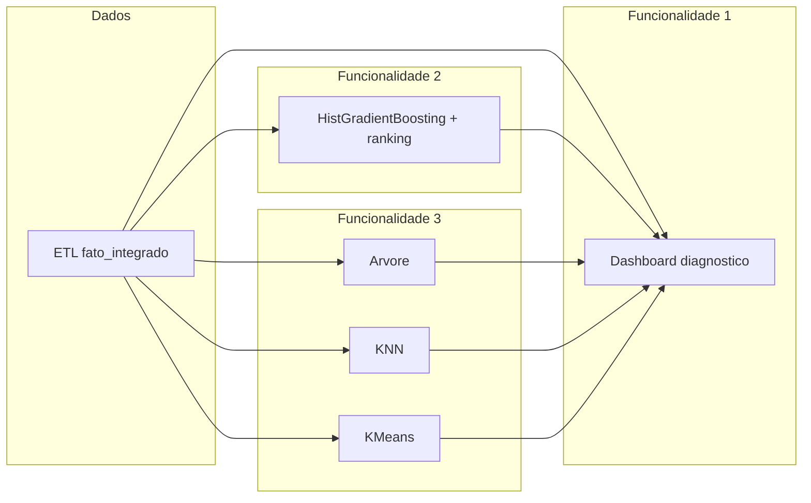

# Relatório das três funcionalidades do sistema

**Projeto:** Evasão escolar — Recife (PE)  
**Usuário-alvo:** gestores que querem prevenir abandono e evasão escolar  
**Granularidade dos dados:** uma linha por escola e ano (`fato_integrado`)  
**Alvo da modelagem preditiva:** `taxa_abandono_em` (abandono no Ensino Médio, %)

Este relatório descreve as **três funcionalidades relevantes** do sistema: o que são, o que fazem, como ajudam a resolver o problema do gestor e **como foram implementadas** no repositório.

---

## Visão geral

O sistema não é apenas “um modelo de machine learning”. Ele combina:

| Camada | Papel |
|--------|--------|
| **ETL** (`etl/etl_pipeline.py`) | Organiza dados brutos em tabelas usáveis |
| **Análise exploratória** (`analise_evasao_escolar.ipynb`, notebooks) | Contextualiza o problema |
| **Machine learning** (`ml/baseline_municipio.py`, `ml/educational_ml.py`) | Prevê, compara e segmenta |
| **Dashboard** (`dashboard/app.py`) | Traduz resultados para decisão educacional |

As três funcionalidades abaixo correspondem ao que o gestor **usa de fato** para decidir.

---

## Funcionalidade 1 — Diagnóstico do problema (dashboard analítico)

### O que é

É a capacidade do sistema de **mostrar o cenário da evasão e do abandono** de forma visual e narrativa, antes de entrar em detalhes algorítmicos. Responde à pergunta: *“Como está a situação? O que piorou? O que está ligado a quê?”*

Não depende só do modelo final de ML: usa séries municipais, indicadores educacionais e regras de score já calculadas no painel.

### O que faz

- Exibe **evolução temporal** de evasão e abandono.
- Destaca o **impacto da pandemia** (2020–2022).
- Mostra **relações entre variáveis** (reprovação, TDI, abandono, evasão).
- Calcula um **score de risco** (0–100) com base em abandono EM, TDI e reprovação EM.
- Classifica o risco em faixas: Baixo, Moderado, Alto, Crítico.
- Gera **textos interpretativos** antes e depois dos gráficos (insights automáticos).

### Como ajuda a resolver o problema do gestor

| Necessidade do gestor | Como a funcionalidade ajuda |
|----------------------|------------------------------|
| Entender se o problema está piorando | Séries anuais e comparação de períodos |
| Saber onde focar atenção primeiro | Score de risco e classificação |
| Comunicar o problema para equipe/políticas | Gráficos + linguagem acessível |
| Relacionar abandono com outros indicadores | Mapas de correlação, dispersões (TDI × abandono, etc.) |

Sem esse diagnóstico, o gestor teria apenas números isolados ou um modelo “caixa-preta”. O dashboard **contextualiza** o abandono dentro da cadeia reprovação → TDI → abandono → evasão.

### Como foi implementada

**Arquivo principal:** `dashboard/app.py`

1. **Carregamento de dados**  
   - CSVs em `data/processed/` (gerados pelo ETL).  
   - Funções como `carregar_dados()`, `tabela_municipio_ano()`, `garantir_dados()`.

2. **Score de risco (regra de negócio, não ML)**  
   - Função `calcular_score()`: pesos 40% abandono EM, 30% TDI EM, 30% reprovação EM.  
   - Pesos **renormalizados** quando falta algum indicador (não trata ausência como zero).  
   - `classificar_risco()` converte o score em categorias.

3. **Insights automáticos**  
   - `computar_insights()`: pior/melhor ano de evasão, score atual, variações, etc.  
   - Usado nas páginas 1–4 do painel.

4. **Interface**  
   - Streamlit + Plotly.  
   - Páginas: Contexto Geral, Evolução, Pandemia, Por que os alunos evadem.  
   - Filtros por ano e nível de ensino na barra lateral.

**Artefatos complementares:** `analise_evasao_escolar.ipynb` (análise estática com figuras em `imagens/`).

**Limitação honesta:** parte do diagnóstico usa **evasão municipal** (uma linha por ano na série municipal), enquanto a modelagem preditiva usa **abandono por escola–ano**. O dashboard deixa isso explícito nas narrativas.

### Como visualizar no dashboard

1. Na **raiz do repositório**, inicie o painel:
   ```bash
   streamlit run dashboard/app.py
   ```
2. O navegador abre o dashboard. Na **barra lateral esquerda**, use o seletor **“Secoes do painel”** (botões de rádio).
3. Ajuste os **filtros** na barra lateral antes de explorar:
   - **Intervalo de anos** (slider);
   - **Nível de ensino** (Ensino Fundamental e/ou Ensino Médio).
4. Percorra as **páginas 1 a 4** — todas compõem o diagnóstico:

| Página no painel | O que o gestor vê |
|------------------|-------------------|
| **1. Contexto Geral** | Visão do ano mais recente: evasão EF/EM, abandono EM, TDI, **Score de Risco (0–100)** e classificação (Baixo / Moderado / Alto / Crítico); gráficos de gauge; variação dos indicadores no período; textos de insight no topo de cada bloco. |
| **2. Evolucao ao Longo do Tempo** | Séries anuais de evasão e abandono (linhas sólidas e pontilhadas); destaque visual do período da pandemia (2020–2022). |
| **3. Impacto da Pandemia** | Explicação dos mecanismos do choque COVID-19 e gráficos comparando antes, durante e depois da pandemia. |
| **4. Por que os Alunos Evadem?** | Cadeia reprovação → TDI → abandono → evasão; dispersões (ex.: TDI × abandono); **mapa de correlação** entre indicadores no nível escola–ano. |

**Dica:** se os dados não carregarem, use o botão **“Reprocessar dados (ETL)”** na barra lateral (o ETL também roda automaticamente na primeira abertura).

---

## Funcionalidade 2 — Priorização de risco com machine learning

### O que é

É a **estimativa supervisionada** da taxa de abandono no Ensino Médio (`taxa_abandono_em`) para cada observação escola–ano, com **ranking de prioridade** para ação preventiva. Responde: *“Quem deve ser atendido primeiro?”*

O **modelo principal** é o `HistGradientBoostingRegressor`, ajustado por busca de hiperparâmetros e validado no tempo.

### O que faz

- Treina modelos com dados históricos (anos ≤ 2017) e testa em anos recentes (≥ 2018).
- Compara **três regressores**: HistGradientBoosting, árvore de decisão, KNN.
- Escolhe e refina o **HistGradientBoosting** com `RandomizedSearchCV`.
- Avalia com **validação cruzada temporal** (`TimeSeriesSplit` por ano).
- Gera para cada escola–ano (quando aplicável):
  - previsão de abandono (`pred_modelo_final`, `pred_hgb`);
  - **ranking de risco** (`rank_risco_abandono_previsto`);
- Exporta métricas: MAE, RMSE, R².
- Salva o **modelo final** em `outputs/ml/final_model_bundle.pkl` para inferência futura.

### Como ajuda a resolver o problema do gestor

| Necessidade do gestor | Como a funcionalidade ajuda |
|----------------------|------------------------------|
| Priorizar escolas/anos com maior risco | Ranking por abandono previsto |
| Ir além da intuição | Previsão baseada em vários indicadores |
| Planejar intervenções com ordem | Lista ordenada no teste e no CSV exportado |
| Reutilizar o modelo em novos dados | `predict_taxa_abandono_em()` + bundle `.pkl` |

O gestor deixa de depender só de “quem já abandonou” e passa a considerar **quem tende a apresentar abandono elevado** segundo o padrão aprendido nos dados.

### Como foi implementada

**Módulos:** `ml/baseline_municipio.py`, `ml/educational_ml.py`

**Pipeline de dados para ML**

1. `load_fato_integrado()` lê `data/processed/fato_integrado.csv`.
2. `prepare_temporal_supervised_split(year_cutoff=2017)`:
   - remove linhas sem `taxa_abandono_em`;
   - separa treino/teste por ano;
   - exclui vazamento: não usa `indice_risco_evasao` nem `id_linha_educacional` como feature.

**Pré-processamento (sklearn `Pipeline`)**

- Numéricas: `SimpleImputer(median)` + `StandardScaler`.
- Categóricas: `SimpleImputer(most_frequent)` + `OneHotEncoder`.
- Implementado em `build_preprocess_transformer()` e nos `make_*_pipeline()`.

**Treino e comparação**

- `run_model_comparison_experiment()`: treina HGB, árvore e KNN no mesmo teste.
- `run_educational_ml_suite()`: orquestra tudo e exporta artefatos.

**Modelo final**

- `_tune_hist_gradient_boosting()`: `RandomizedSearchCV` com CV temporal por ano.
- Métricas: `evaluate_regression()` → MAE, RMSE, R².
- Curva de aprendizado e resumo por fold em CSV/figuras.
- `_save_final_model_bundle()` + `predict_taxa_abandono_em()` para inferência.

**Saídas principais**

| Artefato | Conteúdo |
|----------|----------|
| `outputs/ml/escola_ano_ml_enriquecido.csv` | Previsões, cluster, ranking |
| `outputs/ml/ml_storytelling.json` | Métricas, parâmetros, narrativas |
| `outputs/ml/final_model_bundle.pkl` | Modelo serializado |
| `outputs/figures/ml_hgb_*.png` | Observado × previsto, importância, ranking |

**Notebook de reprodução:** `notebooks/modelagem_evasao_municipio.ipynb` (§5–§9).

**Comando para regenerar tudo:**

```bash
python3 -c "from ml.educational_ml import run_educational_ml_suite; run_educational_ml_suite()"
```

**Limitação honesta:** a base tem poucas linhas no teste temporal; métricas no holdout podem ser boas, mas a **validação cruzada** mostra variabilidade entre folds — o sistema documenta isso em `final_model_cv_diagnosis` no JSON e no dashboard.

### Como visualizar no dashboard

**Pré-requisito:** gere os artefatos de ML uma vez (na raiz do projeto):

```bash
python3 -c "from ml.educational_ml import run_educational_ml_suite; run_educational_ml_suite()"
```

1. Abra o dashboard: `streamlit run dashboard/app.py`.
2. Na barra lateral, selecione **“5. Conclusoes e Modelo Preditivo”**.
3. Role até o bloco **“Apoio inteligente — abandono no EM e risco escolar”** (função `render_ml_inteligencia_section()`).
4. Nesse bloco, a priorização aparece em:

| Elemento na tela | Conteúdo |
|------------------|----------|
| **Modelo final escolhido** | Nome do HGB ajustado e métricas **MAE**, **RMSE**, **R²** no teste temporal. |
| **Validacao cruzada temporal** | Tabela de estabilidade e texto de diagnóstico (overfitting / variância entre folds). |
| **Comparacao dos tres regressores** | Tabela MAE/RMSE/R² de HGB, árvore e KNN no mesmo teste. |
| **Figuras** | Observado × previsto, importância de variáveis, tuning, CV por fold, curva de aprendizado. |
| **Maior abandono previsto no teste (priorizacao)** | Tabela com as 15 linhas de maior `pred_hgb` / `pred_modelo_final`, com **rank_risco_abandono_previsto**, `ano` e `id_linha_educacional`. |

Se o bloco mostrar *“Ainda nao ha ficheiros exportados”*, execute o comando acima ou o notebook `notebooks/modelagem_evasao_municipio.ipynb` (seção 7) e recarregue a página.

**Alternativa fora do dashboard:** abra `outputs/ml/escola_ano_ml_enriquecido.csv` e ordene por `rank_risco_abandono_previsto` ou `pred_modelo_final`.

---

## Funcionalidade 3 — Explicação e comparação de perfis

### O que é

É o conjunto de ferramentas que **explicam o risco** e **agrupam escolas semelhantes**, além de prever. Responde:

- *“Por que esse risco é alto?”* (árvore de decisão)
- *“Quem se parece com quem?”* (KNN)
- *“Que tipos de escola existem no sistema?”* (KMeans)

São **três papéis complementares** ao modelo principal de previsão.

### O que faz

| Componente | Tipo | O que entrega |
|-----------|------|----------------|
| **DecisionTreeRegressor** | Regressão supervisionada | Regras do tipo “se TDI > X e reprovação > Y, abandono tende a subir”; figura da árvore; texto exportado |
| **KNeighborsRegressor** | Regressão + similaridade | Lista de “escolas vizinhas” no espaço de features; radar comparativo (ilustrativo) |
| **KMeans** | Clusterização não supervisionada | Grupos de perfil; médias por cluster; gráficos cotovelo, silhueta, PCA |

Tudo isso roda no mesmo split temporal e no mesmo pré-processamento que a regressão, para manter coerência metodológica.

### Como ajuda a resolver o problema do gestor

| Necessidade do gestor | Ferramenta que ajuda |
|----------------------|---------------------|
| Explicar decisões em reunião | Árvore (regras em português) |
| Benchmark: “escolas como a nossa” | KNN (vizinhos mais próximos) |
| Políticas por segmento (não só por escola) | KMeans (grupos vulneráveis vs estáveis) |
| Confiança no modelo preditivo | Comparação explícita entre três regressores |

O gestor ganha **narrativa e segmentação**, não apenas um número de risco.

### Como foi implementada

**Módulo:** `ml/educational_ml.py` (funções dedicadas)

**Árvore de decisão**

- `make_decision_tree_pipeline()` em `baseline_municipio.py` (profundidade limitada, ex.: 4).
- `tree_interpretation_summary()`: `export_text` do sklearn → regras em markdown.
- `plot_decision_tree_simple()`: PNG `outputs/figures/ml_decision_tree.png`.

**KNN**

- `make_knn_pipeline()` com `KNeighborsRegressor`, pesos `distance`, features normalizadas.
- `knn_similar_rows()`: para uma linha de consulta, retorna vizinhos do treino com distância e `id_linha_educacional`.
- `plot_knn_radar_sample()`: compara indicadores brutos (TDI, reprovação, abandono, etc.).
- CSV exemplo: `outputs/ml/knn_vizinhos_exemplo_primeira_linha_teste.csv`.

**KMeans**

- Pré-processamento das covariáveis (sem usar o alvo nos centróides).
- `choose_kmeans_k()`: cotovelo + silhueta → escolhe número de clusters.
- `kmeans_cluster_profiles()`: médias por cluster + texto automático (“grupo com maior abandono médio…”).
- Figuras: `ml_kmeans_elbow.png`, `ml_kmeans_silhouette.png`, `ml_kmeans_scatter_pca.png`.
- Tabela: `outputs/ml/kmeans_perfil_medio_por_cluster.csv`.

**Integração no dashboard**

- Função `render_ml_inteligencia_section()` em `dashboard/app.py` (página 5):
  - lê `ml_storytelling.json` e CSVs;
  - mostra papéis dos algoritmos, figuras, tabela de vizinhos, perfis KMeans, expander com regras da árvore.

**Notebook:** `notebooks/modelagem_evasao_municipio.ipynb` (§7 e seguintes).

### Como visualizar no dashboard

Usa a **mesma página** da Funcionalidade 2: **“5. Conclusoes e Modelo Preditivo”** → bloco **“Apoio inteligente”**. O pré-requisito é o mesmo (`run_educational_ml_suite()`).

| Ferramenta | Onde clicar / rolar no painel |
|------------|-------------------------------|
| **Árvore de decisão** | Imagem **“Arvore (visao simplificada)”**; expanda **“Regras em texto (arvore de decisao)”** para ler os limiares em português. |
| **KNN (escolas parecidas)** | Seção **“KNN — exemplo de escolas vizinhas”** — tabela com vizinhos da primeira linha do teste; gráfico radar abaixo (se `ml_knn_radar_exemplo.png` existir). |
| **KMeans (perfis)** | Seção **“KMeans — grupos e interpretacao”** — texto automático dos grupos, tabela de médias por cluster e figuras de cotovelo / PCA. |
| **Comparação entre regressores** | Tabela e narrativa em **“O que os modelos mostram”** e **“Papel de cada algoritmo”** — contextualiza árvore e KNN frente ao HGB. |

**Alternativa fora do dashboard:** figuras em `outputs/figures/ml_*.png` e tabelas em `outputs/ml/knn_vizinhos_exemplo_primeira_linha_teste.csv` e `kmeans_perfil_medio_por_cluster.csv`.

---

## Como as três funcionalidades se conectam



Fluxo típico de uso pelo gestor:

1. **Diagnóstico** — entende o problema na cidade e na cadeia de indicadores.  
2. **Priorização** — vê quem o modelo indica como maior risco de abandono previsto.  
3. **Explicação e perfis** — entende porquês e com quem comparar, e quais grupos existem.

---

## Guia rápido — como o usuário visualiza tudo no dashboard

### Passo a passo geral

| Passo | Ação |
|-------|------|
| 1 | Clonar/abrir o repositório e instalar dependências (`pip install -r requirements.txt`). |
| 2 | Garantir dados processados (ETL roda ao abrir o painel ou via botão na barra lateral). |
| 3 | Para ML (funcionalidades 2 e 3), executar `run_educational_ml_suite()` (comando acima). |
| 4 | Na raiz: `streamlit run dashboard/app.py`. |
| 5 | Navegar pelas seções na **barra lateral** → **“Secoes do painel”**. |

### Mapa funcionalidade → tela

| Funcionalidade | Seção do painel | Blocos principais |
|----------------|-----------------|-------------------|
| **1. Diagnóstico** | Páginas **1–4** | Métricas, score, evolução, pandemia, correlações (ver tabelas em cada seção acima). |
| **2. Priorização** | Página **5** → *Apoio inteligente* | Modelo final, métricas, ranking das 15 maiores previsões de abandono. |
| **3. Explicação e perfis** | Página **5** → *Apoio inteligente* | Árvore, expander de regras, KNN, KMeans. |

### Fluxo sugerido para o gestor

1. **Contexto Geral (pág. 1)** — entender o score e os números do ano corrente.  
2. **Evolução (pág. 2)** e **Pandemia (pág. 3)** — ver tendência e choque externo.  
3. **Por que evadem (pág. 4)** — validar a cadeia de indicadores.  
4. **Conclusões e Modelo Preditivo (pág. 5)** — rolar até *Apoio inteligente* para priorizar, explicar e segmentar.

**Documentação formal do problema:** `docs/definicao_problema_e_escopo.md`  
**Plano de dados:** `docs/plano_tecnico_dados.md`

---

## Conclusão

As três funcionalidades formam um **sistema de apoio à decisão educacional**:

1. **Diagnóstico** — entender o cenário (dashboard + score + narrativas).  
2. **Priorização** — prever e ranquear risco de abandono (ML supervisionado com modelo final ajustado).  
3. **Explicação e perfis** — explicar, comparar e segmentar (árvore, KNN, KMeans).

Juntas, permitem que o gestor **compreenda**, **priorize** e **justifique** ações de prevenção de abandono e evasão, com implementação reprodutível em código, notebooks executados e artefatos exportados para o dashboard.
